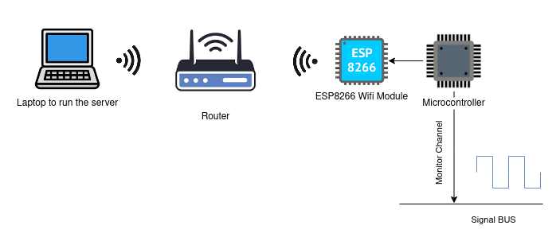

# Wireless-Logic-Analyzer

## Description
Continuous monitoring of logic signal channels for real-time analysis. Inspired by Saleae Logic Analyzer. Sent wirelessly over wifi through a tcp connection to a server to view it graphicaly in real time.
 
the project tested with UART protocol with baudrate of 200,000.

## System Architecture

## Modules

### Python Server
responsible for listening for incomming connections from monitoring chip and receive different packets from monitoring chip then graphically show it. 

requirements
 - [x] ability of horizontally zooming
 - [x] ability of auto scroll with new updates (live monitoring)
 - [x] support multi channel monitoring
 - [ ] add decoding engines for different protocols.
 - [ ] add ability to do certian actions based on some patterns in the data.
 
 
### Monitoring chip
the chip is responsible for continously monitor the logic level on the buses using ICU(input capture unit) to detect rising and falling edge. also responsible for forming packets and send it to the server.

#### Packets
- Initialize packet
	- used to send the initial state of the monitored bus
	- form [ 0(1-bit) | channel_number(16-bits) | pin_state(16-bits)]
	
- Update packet
	- used to update any changes happend in the buses. 
	- form [ 1(1-bit) | channel_number(16-bits) | pin_state(16-bits) | counter(32-bits) | old_capture(16-bits) | new_capture(16-bits)]
		- duration of state = counter * TIMER_MAX + new_caputre - old_capture
		- old_capture: the timer value when the bus entred the current state
		- new_caputre : the timer value when the bus left the state
		- counter : number of timer overflows happend while the the bus state didn't change.
		
## Test

